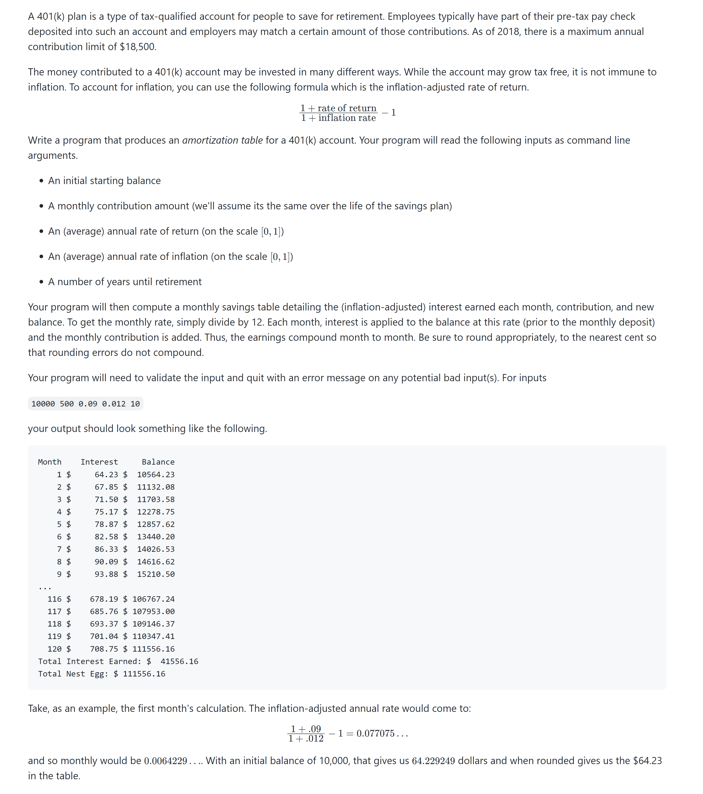

# RetirePlan

👋Hey There!!! This is my HACK-4 Assignment
======================================================

Here you go ⋙⋙⋙⋙

Directory Layout
======================================================
* [hack4](https://github.com/Aayush-cyborg/hack4)---------------------------# Application repository
   * [.gitignore](https://github.com/Aayush-cyborg/hack4/blob/main/.gitignore)  -----------------------# .gitignore file
   * [Retire.c](https://github.com/Aayush-cyborg/hack4/blob/main/retire.c)--------------------# Main source code written in C language

Problem Statement
======================================================

